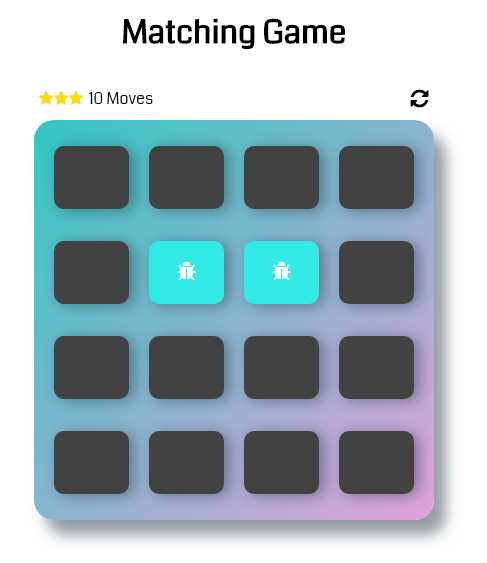
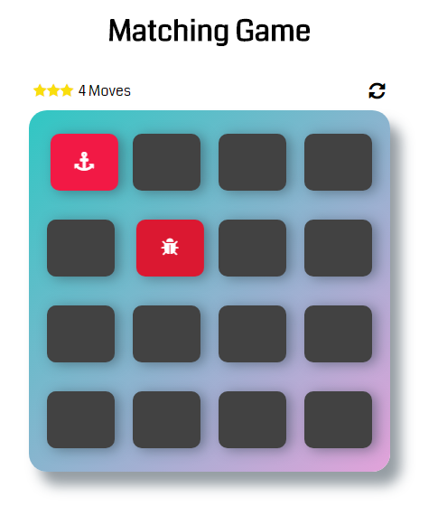
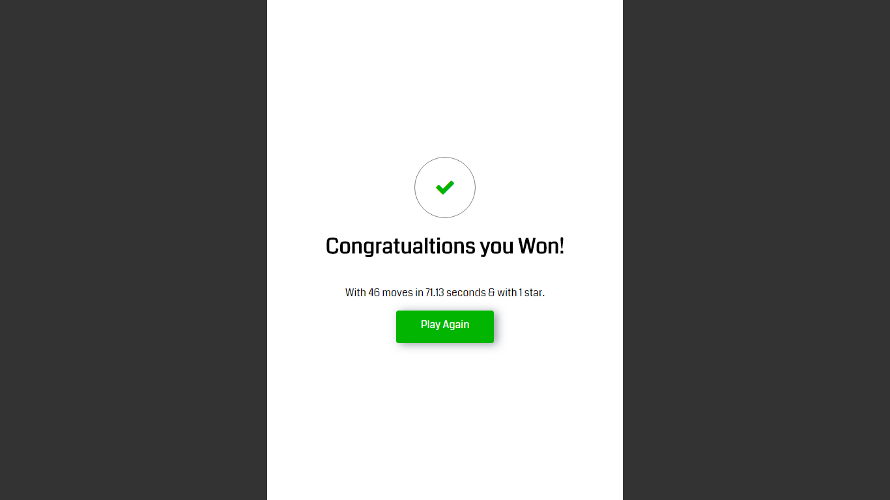

# Memory Game Project

## Table of Contents

* [Game Rules](#game_rules)
* [Game Technical workflow](#technical)

## Game Rules

* There are eight pairs of cards on the game board.
* Once you click on a card, it will flip & show you its icon.
* When you click on another card & after that card flips:
	* In case this card icon matches the one that was flipped earlier then both cards will turn blue.
		
	* In case both cards don't match then both cards will be flipped on their back again.
		
* Every card you flip will be considered as a move & will be incremented in the counter you see above the game board.
	* After 17 moves you will loose one star, after 33, you'll loose two stars & after 49 moves all stars will be dimmed.
* After you successfully manage to match all pairs, a success window will open showing how many moves you've done & how long have you spent.
	
	

## Technical

* This project includes the following assets:
	* **index.html** This is where the game html structure is located.
	* **main.css** This is where the game board styling is located.
	* **app.js** This is where all the board actions reside.
