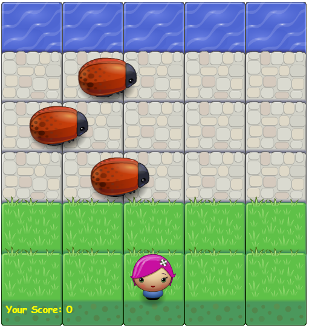
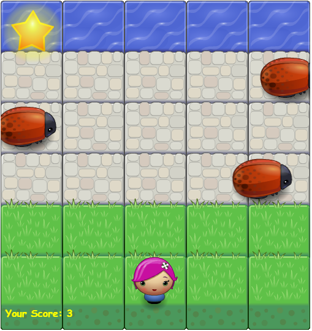

frontend-nanodegree-arcade-game
===============================

## Table of Contents

* [Game Rules](#game_rules)
* [Technical](#technical)
* [Credits](#credits)

## Game Rules
- Move the player left, right, up & down to reach the water.
	
- Each time the player reaches the water:
	- The score at the bottom increments by one.
	- A star appears at the top.
	- The player goes back to her initial position.

	
- If the player touches any of the bugs, the score will be reset & the player will go back to her initial position.

## Technical
- The project includes the following assets:
	- `\css` includes the project styles.
	- `\js` includes the javaScript files needed to run the game & it includes the following files:
		- `engine.js` this is the app engine needed to run the game.
		- `resources.js` an image loading utility.
		- `app.js` this is where the player & enemy classes with their functionalities exists.
	- `\images` includes all the images needed for building the arcade game.
	- `index.html` is the main html file & which you'll need to open to start playing your game.

## Credits
- Player & Enemy colliding check referenced from [2D Collision Detection](https://developer.mozilla.org/kab/docs/Games/Techniques/2D_collision_detection)

